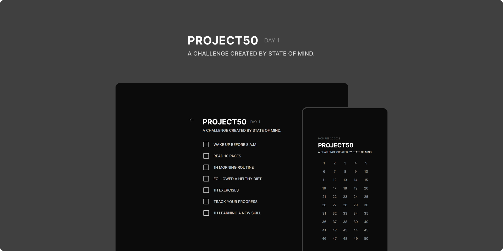

<div align="center">
  
  
  <p align="center">An application to mark your daily progress in Project 50.</p>
  <p align="center">
    <a href="#project">Project</a> · 
    <a href="#how-use">How use?</a> · 
    <a href="#built-with">Built with</a> · 
    <a href="#contribution">Contribution</a>
  </p>
</div>

----

## Project
The Project 50 Challenge is a self-improvement challenge where individuals commit to a task or goal for 50 days to develop positive habits and make progress towards personal or professional goals. 

The challenge has gained popularity on social media platforms like TikTok and Instagram, where participants share their progress and encourage others to join. The project is focused on helping participants in this challenge to mark their progress.

<div align="center">
  
</div>

## How to use?
### For most users
Currently in the project there are two identical versions: Web and Desktop (Electron). You can use the Web version on your computer or smartphone through your preferred browser. To use it, just click on the link in the project description or [click here](https://project50-calendar.vercel.app/) to be redirected.

For users who want to Download the executable for their respective system, you can enter the releases section of github or [click here](https://github.com/KarineBrandelli/calendar-project50/releases) to be redirected there. It is recommended to always download the latest version available.

### For developers
In order to be able to successfully test the app in your development environment make sure you have installed **nodejs** and **npm**.

- Clone this repository on your machine:
  ```bash
  git clone https://github.com/KarineBrandelli/calendar-project50
  ```

- To test the web version run the following commands:
  ```bash
  cd web/ && npm i && npm run dev
  ```

- To test the electron version run the following commands:
  ```bash
  cd electron/ && npm i && npm run dev
  ```

## Built with
- [Vite](https://vitejs.dev/)
- [Electron Vite](https://evite.netlify.app/)
- [React](https://reactjs.org/)
- [MUI/Material](https://mui.com/)
- [Phosfor Icons](https://phosphoricons.com/)

## Contribution
If you want to contribute to **Calendar - Project50**, read our [**Contributing Docs**](./.github/CONTRIBUTION.md) before submitting a pull request. Here are some ways to contribute:

- Report any bugs or suggest new features.
- Submit a pull request to improve the codebase.
- Help us with documentation.

We welcome developers of all skill levels and backgrounds. Let's work together to make our application better for our users!